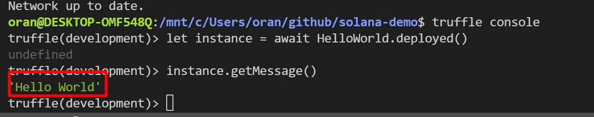
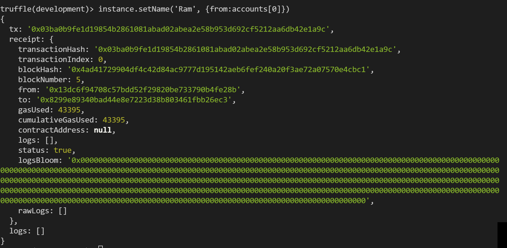
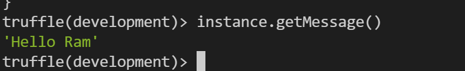
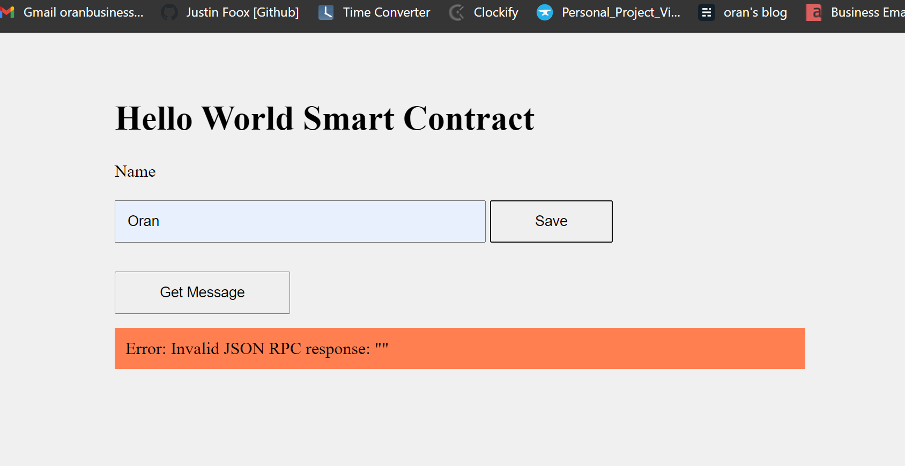
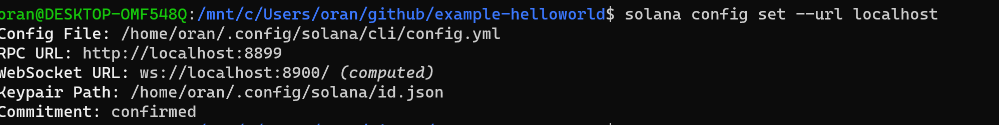
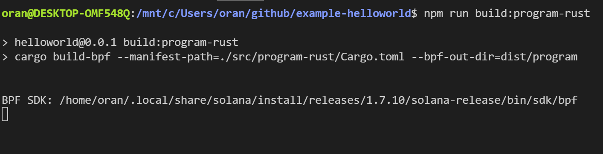

# solana-demo
----
[](https://github.com/ellerbrock/open-source-badges/)
[](https://opensource.org/licenses/MIT)
<!--  -->
<h2 align="center">this app is to test out the solana blockchain</h2>

<!-- <h4 align="center">________________________</h4> -->


# Quick start
### __________________
<!-- 
##### __________________________
```bash
``` 
-->

# Summary
<!-- ### -  *[Quick start](#Quick-start)*
### -  *[Installation](#Installation)*
### -  *[For developers](#For-developers)* -->
### -  *[Contributors](#Contributors)*
### -  *[License](#License)*


# Installation
```bash
```

<!-- ----------------- -->
<!-- # Screenshots -->
<!-- -   -->
<!-- -  -->


<!-- SETUP -->
-----------------
# For developers
### 
```bash
npm install -g @decentology/dappstarter
```

# Tangent learning etherium nft solidity
## tutorial link: [](https://techbrij.com/setup-local-private-blockchain-deploy-smart-contract-ethereum-dapp-part-2)
```bash
npm install -g truffle
truffle init

truffle create contract HelloWorld
truffle compile
truffle create migration HelloWorld
```
#### adjust truffle-config.js to match your port number mine happens to be 7545
```

truffle migrate


truffle console
let instance = await HelloWorld.deployed()
instance.getMessage()
```
## Success! 🎉🎉🎉


### Run another piece of code
```bash
let accounts = await web3.eth.getAccounts()
instance.setName('Ram',{from: accounts[0]})
instance.getMessage()
```


### create unit tests
```bash
truffle create test HelloWorld

truffle develop
truffle(develop)> migrate
truffle(develop)> test
Mnemonic: draft melody index license maid receive uncover maid upper jealous rotate play
http://127.0.0.1:9545/
```


# setup server for app
### setup express
### https://techbrij.com/web-ui-smart-contract-ethereum-dapp-part-4
```bash

npm init
npm install express --save

npm install dotenv --save
npm start

sudo apt-get install build-essential

npm install truffle-contract --save-dev


FIX: use old version of webpack
npm install webpack@4 webpack-cli@4 --save-dev


npm run webpack

npm run dev
```
### issue 

### fix
#### block chain is not running!
#### open genache
#### verify that the port is correctly set in both .env and truffle-config.js
```bash
# window 1
# truffle compile
# truffle create migration HelloWorld
# truffle migrate

truffle migrate --reset
# window 2
npm run dev
```


### setting up with infra
```bash


how to get free eth on test net
https://faucet.rinkeby.io/


npm install truffle-hdwallet-provider --save

truffle migrate --network rinkeby
https://rinkeby.etherscan.io/address/0x2266b382D688AF7CF510dbaF3A7961b6C8d0933a

https://rinkeby.etherscan.io/address/0x2266b382d688af7cf510dbaf3a7961b6c8d0933a

truffle console --network rinkeby
let instance = await HelloWorld.deployed()
instance.getMessage()


let accounts = await web3.eth.getAccounts()
instance.setName('Ram',{from: accounts[0]})
instance.getMessage()

curl https://cli-assets.heroku.com/install-ubuntu.sh | sh

npm run webpack

heroku login
heroku git:remote -a solana-demo

git config --global user.email "oranbusiness@gmail.com"
git config --global user.name "Oran C"
sudo apt-get install git-lfs
git add .
git commit -am "[add] heroku stuff"
git push heroku master
```


# getting back to actually making a solana hello world
```
git clone https://github.com/solana-labs/example-helloworld.git
cd example-helloworld
INSTALL RUST
curl --proto '=https' --tlsv1.2 -sSf https://sh.rustup.rs | sh
rustc
INSTALL SOLANA CLI
sh -c "$(curl -sSfL https://release.solana.com/v1.7.10/install)"
<!-- export PATH="~/.local/share/solana/install/active_release/bin:$PATH" >> ~/.profile -->
code ~/.profile
solana --version
npm --version
node --version
solana config set --url localhost
```

```
solana-keygen new
solana-test-validator
# new page
solana logs

npm install
rustup component add rustfmt
rustup update
### https://github.com/solana-labs/solana
sudo apt-get update
<!-- sudo apt-get install libssl-dev libudev-dev pkg-config zlib1g-dev llvm clang make -->
cd src/program-rust/
cargo build
npm run build:program-rust


solana-test-validator
solana program deploy dist/program/helloworld.so

npm run start
## new terminal window
solana logs
```
### configure devnet 
```bash
https://docs.solana.com/cli/choose-a-cluster
solana config get
```

# fix for getting rust installed on wsl
### https://reginafurness.medium.com/installing-rust-on-windows-and-visual-studio-code-with-wsl-fa4fb92ffd1
#### https://visualstudio.microsoft.com/visual-cpp-build-tools/
#### Restart you pc and then run ---v again
```bash
npm run build:program-rust
```

-----------------
# Contributors

[](https://github.com/wisehackermonkey/solana-demo/graphs/contributors)

##### Made with [contributors-img](https://contrib.rocks).

-----------------
# License
#### MIT © wisehackermonkey
[](https://opensource.org/licenses/MIT)
```bash
by oran collins
github.com/wisehackermonkey
oranbusiness@gmail.com
______________________
```


